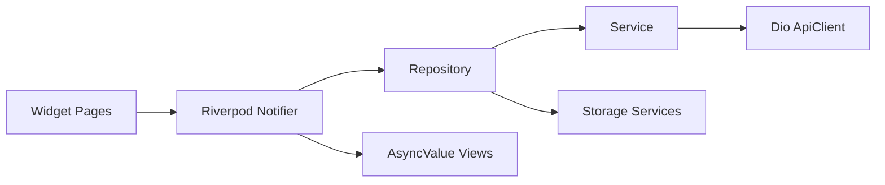

# Flutter Starter Template

A production-oriented Flutter starter template for Android, iOS, Web, Windows, macOS, and Linux. It uses Flutter stable, Dart stable, Riverpod 3, go_router, dio, Material 3, official Flutter localization, and `liquid_glass_widgets`.

**Fork 后请先阅读 [docs/TEMPLATE_CHECKLIST.md](docs/TEMPLATE_CHECKLIST.md)。**

## Architecture

The project uses a feature-first structure with shared application and core infrastructure layers.

- `lib/app`: app composition, routing, theme, localization, environment, lifecycle, design tokens.
- `lib/core`: logging, errors, networking, storage, messaging, crash and analytics abstractions, common UI state widgets.
- `lib/features`: splash, auth, version, home, settings.
- `lib/shared`: reusable providers and layout widgets.
- `test`: unit, provider, and widget tests.



## Design System

Mobile compact layout is calibrated around an iPhone 17 Pro style baseline of about `402 x 874` logical pixels. `AppSpacing`, `AppRadius`, `AppSizing`, `AppTypography`, `AppBreakpoints`, `AppDurations`, `AppShadows`, `AppGlassTokens`, `AdaptiveScale`, and `ResponsiveLayout` keep visual rules centralized.

## Environments

Use `APP_ENV` to select environment configuration:

```sh
flutter run --dart-define=APP_ENV=debug
flutter run --dart-define=APP_ENV=prod
flutter build apk --dart-define=APP_ENV=prod
flutter build appbundle --dart-define=APP_ENV=prod
flutter build ios --dart-define=APP_ENV=prod
flutter build web --dart-define=APP_ENV=prod
flutter build macos --dart-define=APP_ENV=prod
flutter build windows --dart-define=APP_ENV=prod
flutter build linux --dart-define=APP_ENV=prod
```

Debug defaults to **mock services** (`EnvConfig.enableMock`) and verbose logs. Prod disables mock, minimizes logs, and sanitizes sensitive fields such as password, token, authorization, and cookie.

To call a real API in debug, set `enableMock: false` in `lib/app/environment/env_config.dart` and configure `baseUrl`.

## Development

```sh
flutter pub get
flutter gen-l10n
dart run build_runner build --delete-conflicting-outputs
dart format lib test
flutter analyze
flutter test
```

The current template avoids mandatory generated Riverpod files, but `build_runner` and `riverpod_generator` are included for future expansion.

## Mock Credentials

In debug with `enableMock: true`, any valid **email** and password with at least six characters can log in or register. Tokens are stored through the secure storage abstraction. On Web, secure browser storage still carries XSS risk; production apps should pair it with a hardened CSP, short-lived access tokens, refresh-token rotation, and server-side session invalidation.

## API Integration

Default remote auth uses email/password JSON (`RemoteAuthService`). For mobile-ID or custom backends, see `ExampleBackendAuthService` and [docs/TEMPLATE_CHECKLIST.md](docs/TEMPLATE_CHECKLIST.md). Replace `baseUrl` in `EnvConfig` and adjust parsing in the service layer. UI must not call dio directly.

## Crash And Analytics

`CrashReporter` and `AnalyticsService` are vendor-neutral abstractions. Wire Firebase Crashlytics, Sentry, or another SDK behind these interfaces without leaking SDK calls into feature code.

## CI/CD

`.github/workflows/flutter_ci.yml` runs pub get, formatting check, analyze, tests (including `test/integration/`), and a web build. Add signing credentials through GitHub secrets only; do not commit certificates, provisioning profiles, keystores, or API keys.
