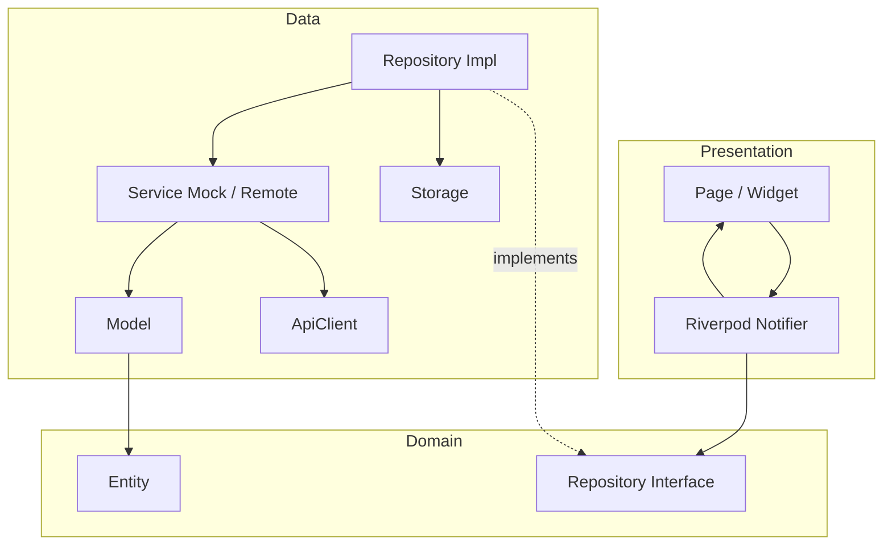
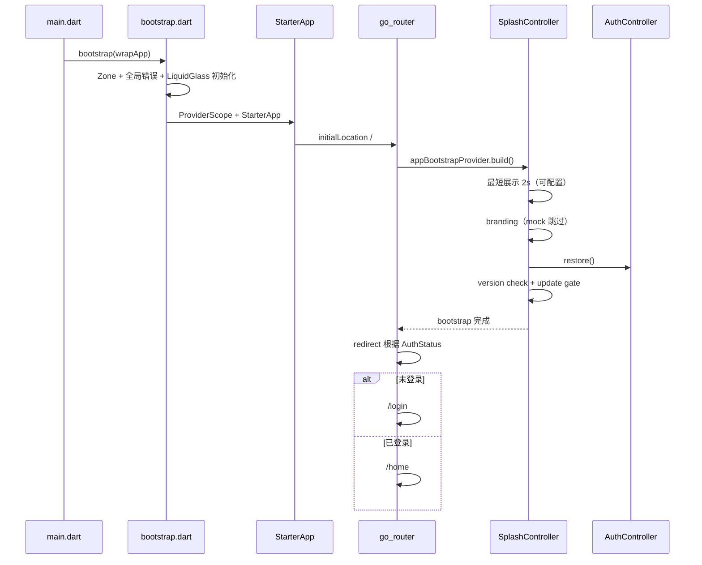
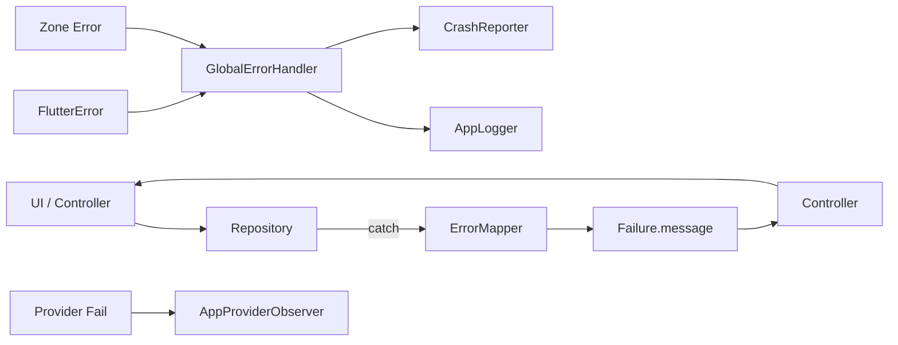

# 项目框架介绍

本文档说明 **Flutter Starter Template** 的整体架构、目录分层、核心模块与扩展方式，适合团队 onboarding、Code Review 或二次封装时查阅。

> 相关文档：[新手指引](./GETTING_STARTED.md) · [Fork 后必改清单](./TEMPLATE_CHECKLIST.md) · [README](../README.md)

---

## 1. 项目定位

这是一个 **生产向 Flutter 脚手架模版**，目标不是「零配置成品 App」，而是提供：

- 清晰的分层与 **Feature-First** 目录
- **Riverpod 3** 状态管理 + **go_router** 路由 + 认证守卫
- **Material 3** + **iOS 26 Liquid Glass** 设计系统（iPhone 17 Pro 基准）
- 国际化、环境切换、Mock/Remote 服务切换
- 网络、存储、日志、错误处理等横切能力
- 可运行的示例流程：启动 → 登录 → 首页 / 设置 → 版本检查

Fork 后请配合 [TEMPLATE_CHECKLIST.md](./TEMPLATE_CHECKLIST.md) 替换包名、API、业务页面。

---

## 2. 技术栈

| 类别 | 选型 | 说明 |
|------|------|------|
| 语言 / SDK | Dart ^3.12、Flutter Stable | 全平台目标 |
| 状态管理 | `flutter_riverpod` ^3.3 | 手写 `NotifierProvider`，无强制代码生成 |
| 路由 | `go_router` ^17 | 声明式路由 + `redirect` 守卫 |
| 网络 | `dio` ^5 | 封装为 `ApiClient` |
| 本地存储 | `shared_preferences` + `flutter_secure_storage` | 普通配置 vs Token |
| 国际化 | `flutter_localizations` + ARB | `context.l10n` |
| UI 玻璃效果 | `liquid_glass_widgets` ^0.19 | `AppGlass*` 封装层 |
| 图标 | `flutter_svg` + `cupertino_icons` | SVG 资源集中管理 |
| 日志 | `logger` | 环境感知 + 脱敏 |
| 测试 | `flutter_test` + `mocktail` | 单元 / Widget / 集成测试 |

完整依赖见根目录 `pubspec.yaml`。

---

## 3. 目录结构总览

```
lib/
├── main.dart                 # 入口：LiquidGlass 包装 + bootstrap
├── bootstrap.dart            # Zone、全局错误、ProviderScope
├── app/                      # 应用装配层（与具体业务弱耦合）
├── core/                     # 横切基础设施
├── features/                 # 按功能垂直切分
├── shared/                   # 跨 Feature 的 Provider / Widget
└── l10n/                     # ARB 源文件 + generated/
```

### 3.1 `lib/app/` — 应用装配层

负责把「一个可运行的 App」拼起来，不包含具体业务规则。

| 子目录 | 职责 | 代表文件 |
|--------|------|----------|
| `environment/` | `APP_ENV`、`baseUrl`、`apiPrefix`、Mock、Feature Flags | `env_config.dart`, `feature_flags.dart` |
| `router/` | 路由表、认证重定向、Tab Shell | `app_router.dart`, `app_routes.dart`, `main_tab_shell.dart` |
| `theme/` | Material 主题、玻璃主题、ThemeExtension | `app_theme.dart`, `app_typography_tokens.dart` |
| `design/` | 间距、圆角、断点、动效等设计 Token | `app_spacing.dart`, `app_radius.dart` |
| `localization/` | 语言切换与扩展 | `locale_controller.dart`, `l10n_extensions.dart` |
| `lifecycle/` | 前后台恢复逻辑 | `app_lifecycle_observer.dart` |
| `app.dart` | 根 Widget `StarterApp` | `MaterialApp.router` 挂载点 |

### 3.2 `lib/core/` — 核心基础设施

全项目复用的「技术能力」，Feature 通过 Provider 注入使用。

| 子目录 | 职责 | 代表文件 |
|--------|------|----------|
| `network/` | HTTP 客户端、拦截器、网络状态（预留） | `api_client.dart`, `api_interceptor.dart` |
| `storage/` | KV 与安全存储抽象 | `storage_service.dart`, `secure_storage_service.dart` |
| `logging/` | 分级日志、敏感字段脱敏 | `app_logger.dart`, `log_sanitizer.dart` |
| `errors/` | 异常类型、Failure 映射、全局捕获 | `error_mapper.dart`, `global_error_handler.dart` |
| `crash/` | 崩溃上报抽象（占位，可接 Sentry 等） | `crash_reporter.dart` |
| `analytics/` | 分析抽象（占位） | `analytics_service.dart` |
| `messaging/` | 全局 SnackBar | `app_messenger.dart` |
| `constants/` | 存储 Key、SVG 路径常量 | `app_storage_keys.dart`, `app_svg_assets.dart` |
| `utils/` | 通用工具（如邮箱校验） | `validators.dart` |
| `widgets/` | 玻璃组件、加载/错误/空状态 | `glass_scaffold.dart`, `app_error_view.dart` |

### 3.3 `lib/features/` — 功能模块

每个 Feature 按 **垂直切片** 组织，推荐三层：

```
features/<name>/
├── domain/          # 实体、仓储接口（纯 Dart，无 Flutter 依赖为佳）
├── data/            # Model、Service、Repository 实现、Provider 定义
└── presentation/    # Controller、Page、Widget
```

当前内置 Feature：

| Feature | 说明 | 分层完整度 |
|---------|------|------------|
| `splash` | 启动页、Bootstrap、404 | 有 data，无独立 domain |
| `auth` | 登录、注册、会话恢复 | domain + data + presentation 完整 |
| `version` | 版本检查、强更门控、更新弹窗 | 完整 |
| `home` | **占位欢迎页**（Fork 后替换） | 仅 presentation |
| `settings` | 主题、语言、版本、登出 | 仅 presentation + controller |

### 3.4 `lib/shared/` — 共享层

| 内容 | 说明 |
|------|------|
| `providers/` | `packageInfoProvider`、`platformNameProvider` |
| `widgets/` | `PageContainer`、`AppBottomNavigation`、`AppLogo` |

### 3.5 `lib/l10n/` — 国际化

- 源文件：`app_en.arb`、`app_zh.arb`
- 生成：`generated/app_localizations*.dart`（勿手改）
- 配置：根目录 `l10n.yaml`

---

## 4. 分层架构与数据流

模版采用 **简化 Clean Architecture**：无独立 UseCase 层，业务编排放在 `Notifier`（Controller）中。



### 4.1 各层职责

| 层 | 做什么 | 不做什么 |
|----|--------|----------|
| **Presentation** | 布局、表单校验、调用 Controller、展示状态 | 直接 `dio`、直接读写 Storage |
| **Controller** | 状态机、loading/error、调用 Repository | 解析 JSON、拼 HTTP 路径 |
| **Repository** | 组合 Service + 持久化、异常 → Failure | UI 逻辑 |
| **Service** | 单次 API 调用或 Mock 行为 | 管理 Widget 状态 |
| **Domain** | 实体与接口契约 | 依赖 Flutter / Dio |

### 4.2 以登录为例的调用链

1. `LoginPage` 校验表单 → `authControllerProvider.notifier.login(email, password)`
2. `AuthController` 设 `loading` → `authRepositoryProvider.login(...)`
3. `AuthRepositoryImpl` 调用 `AuthService`（Mock 或 Remote）
4. 成功：Token 写入 `SecureStorage`，邮箱写入 `SharedPreferences`
5. `AuthController` 更新为 `AuthStatus.authenticated`
6. `go_router` 的 `redirect` 发现已登录 → 跳转 `/home`

关键文件：

- `lib/features/auth/presentation/pages/login_page.dart`
- `lib/features/auth/presentation/controllers/auth_controller.dart`
- `lib/features/auth/data/repositories/auth_repository_impl.dart`
- `lib/features/auth/data/services/mock_auth_service.dart`
- `lib/features/auth/data/services/remote_auth_service.dart`

---

## 5. 应用启动流程



| 步骤 | 文件 | 说明 |
|------|------|------|
| 入口 | `lib/main.dart` | `LiquidGlassWidgets.wrap` + `AppGlassTheme` |
| 启动 | `lib/bootstrap.dart` | 同一 Zone 内 `ensureInitialized` + `runApp` |
| 根组件 | `lib/app/app.dart` | 主题、语言、路由、Messenger Key |
| Bootstrap | `splash_controller.dart` | `appBootstrapProvider` |
| 最短展示 | `splashMinimumDurationProvider` | 默认 2 秒，测试可 override 为 0 |

---

## 6. 路由与导航

### 6.1 路由表

定义于 `lib/app/router/app_routes.dart`：

| 常量 | 路径 | 页面 |
|------|------|------|
| `splash` | `/` | `SplashPage` |
| `login` | `/login` | `LoginPage` |
| `register` | `/register` | `RegisterPage` |
| `home` | `/home` | `HomePage`（Tab 0） |
| `settings` | `/settings` | `SettingsPage`（Tab 1） |

### 6.2 认证守卫（redirect）

逻辑在 `lib/app/router/app_router.dart`，依赖：

- `appBootstrapProvider` — 启动是否完成
- `authControllerProvider` — `AuthStatus` / `isAuthenticated`

规则摘要：

1. Bootstrap 未完成 → 强制留在 Splash
2. `AuthStatus.unknown` → Splash
3. 未登录访问受保护路由 → `/login`
4. 已登录访问 login/register/splash → `/home`
5. 未知路径 → `NotFoundPage`

### 6.3 底部 Tab

使用 `StatefulShellRoute.indexedStack`：

- `MainTabShell`：玻璃 Scaffold + `AppBottomNavigation`
- 切换 Tab **无**左右翻页动画（`goBranch`）
- 跨 Tab 跳转可用 `switchMainTab(context, index)`（`main_tab_navigation.dart`）

---

## 7. 状态管理（Riverpod 3）

### 7.1 使用的 Provider 类型

| 类型 | 用途 | 示例 |
|------|------|------|
| `Provider` | 无状态依赖注入 | `apiClientProvider`, `envConfigProvider` |
| `NotifierProvider` | 同步状态机 | `authControllerProvider`, `themeControllerProvider` |
| `AsyncNotifierProvider` | 异步任务 | `appBootstrapProvider`, `versionControllerProvider` |
| `FutureProvider` | 一次性异步数据 | `packageInfoProvider` |

**说明**：项目已引入 `riverpod_generator`，但当前 **不强制** `@riverpod` 代码生成，便于新手阅读；扩展时可逐步迁移。

### 7.2 关键 Provider 一览

**应用级**

| Provider | 文件 |
|----------|------|
| `envConfigProvider` | `app/environment/env_provider.dart` |
| `themeControllerProvider` | `app/theme/theme_controller.dart` |
| `localeControllerProvider` | `app/localization/locale_controller.dart` |
| `routerProvider` | `app/router/app_router.dart` |

**认证**

| Provider | 文件 |
|----------|------|
| `authControllerProvider` | `features/auth/.../auth_controller.dart` |
| `currentUserProvider` | 同上（派生） |
| `authServiceProvider` | `features/auth/.../auth_repository_impl.dart` |
| `authRepositoryProvider` | 同上 |

**启动 / 版本**

| Provider | 文件 |
|----------|------|
| `appBootstrapProvider` | `features/splash/.../splash_controller.dart` |
| `versionControllerProvider` | `features/version/.../version_controller.dart` |
| `updateGateControllerProvider` | `features/version/.../update_gate_controller.dart` |

**基础设施**

| Provider | 文件 |
|----------|------|
| `apiClientProvider` | `core/network/api_client.dart` |
| `storageServiceProvider` | `core/storage/storage_service.dart` |
| `secureStorageServiceProvider` | `core/storage/secure_storage_service.dart` |
| `appMessengerProvider` | `core/messaging/app_messenger.dart` |

### 7.3 Provider 调试

`bootstrap.dart` 注册 `AppProviderObserver`：Debug 下记录 Provider 初始化；任意 Provider 失败会写日志并走 `CrashReporter` 占位。

---

## 8. 环境与 Mock 策略

### 8.1 环境变量

通过编译期变量 `APP_ENV` 选择：

```sh
flutter run --dart-define=APP_ENV=debug   # 默认
flutter run --dart-define=APP_ENV=prod
```

解析：`lib/app/environment/app_environment.dart`  
聚合配置：`lib/app/environment/env_config.dart` → `EnvConfig.current()`

### 8.2 API 地址结构（主机 + 前缀）

| 配置项 | 示例 | 说明 |
|--------|------|------|
| `baseUrl` | `https://api.example.com` | 仅主机，Debug 可为 `http://192.168.x.x:8091` |
| `apiPrefix` | `/api/v1` | API 网关/版本前缀 |
| `apiBaseUrl`（只读） | `https://api.example.com/api/v1` | `ApiClient` 使用的 Dio 根地址 |
| Service `path` | `/auth/login` | 相对 `apiBaseUrl` 的业务路径 |

换环境只改 `baseUrl`；升级 API 版本只改 `apiPrefix`。拼接逻辑集中在 `EnvConfig.joinApiBaseUrl`。

### 8.3 Debug vs Prod 行为

| 配置 | Debug | Prod |
|------|-------|------|
| `enableMock` | `true` | `false` |
| `enableLog` | `true` | `false` |
| Auth / Version 实现 | Mock 服务 | Remote 服务 |
| Branding 远端请求 | 跳过 | 发起请求 |
| `enableDebugPanel` | 设置页可见 Feature Flags | 关闭 |

### 8.4 Mock 切换点（单一开关 `enableMock`）

| 模块 | 文件 | 行为 |
|------|------|------|
| Auth | `auth_repository_impl.dart` | Mock → `MockAuthService` |
| Version | `version_repository_impl.dart` | Mock → `MockVersionService`（默认无更新） |
| Branding | `splash_controller.dart` | Mock 时直接 return |

对接真实 API：将 `enableMock` 设为 `false`，配置 `baseUrl`（主机）与 `apiPrefix`（如 `/api/v1`）。非通用后端可参考 `example_backend_auth_service.dart`。

---

## 9. 设计系统

### 9.1 设计基准

- 移动端 Compact 以 **iPhone 17 Pro** 逻辑宽约 **402px** 为 1x
- 详细色值与玻璃参数：`docs/iphone_17_pro_ui_theme.md`
- 排版 Token 与缩放：`docs/ios_font.md`

### 9.2 Token 层次

```
app/design/          # 原始 Token（间距、圆角、断点…）
       ↓
app/theme/           # ThemeData、ThemeExtension、ColorScheme
       ↓
core/widgets/        # AppGlass* 组件封装
       ↓
features/.../pages   # 业务页面（禁止硬编码圆角/字号）
```

### 9.3 页面访问主题的方式

| 扩展 | 文件 | 用法 |
|------|------|------|
| `context.l10n` | `l10n_extensions.dart` | 国际化文案 |
| `context.typography` | `typography_extensions.dart` | 语义字号（`pageTitle`、`cardSubtitle`…） |
| `context.colors` | `theme_extensions.dart` | 业务色 Token |
| `context.gradients` | `theme_extensions.dart` | 页面渐变 |
| `context.glass` | `theme_extensions.dart` | 玻璃 Surface 参数 |

### 9.4 圆角规范

所有 UI 圆角必须来自 `lib/app/design/app_radius.dart`，例如：

- 输入框：10
- 按钮 / 列表：12
- 卡片：20
- Tab Bar：32
- 主按钮：胶囊 `AppRadius.capsule(height)`

### 9.5 玻璃 UI

- 第三方：`liquid_glass_widgets`
- 全局主题：`lib/app/theme/app_glass_theme.dart`（在 `main.dart` 注入）
- 封装组件：`AppGlassScaffold`、`AppGlassCard`、`AppGlassButton` 等
- 交互：默认关闭彩色光晕（`glowColor: transparent`）

---

## 10. 国际化（i18n）

| 项 | 说明 |
|----|------|
| 源文件 | `lib/l10n/app_en.arb`、`app_zh.arb` |
| 生成命令 | `flutter gen-l10n` |
| 页面用法 | `context.l10n.login` 等 |
| 持久化 | `LocaleController` → `AppStorageKeys.locale` |
| 约束 | **禁止**在 Widget / Controller 硬编码用户可见中文或英文 |

新增文案流程：编辑 ARB（中英同步）→ `flutter gen-l10n` → 代码引用。

---

## 11. 网络与存储

### 11.1 网络

- `ApiClient`：Dio 的 `baseUrl` 使用 `EnvConfig.apiBaseUrl`（`baseUrl` + `apiPrefix` 拼接）
- `ApiInterceptor`：Debug 请求/响应日志 + 脱敏（**尚未**注入 Token / 处理 401）
- 约定：UI 与 Controller **不得**直接使用 Dio

### 11.2 存储

| Key | 存储 | 用途 |
|-----|------|------|
| `auth_token` | Secure Storage | 访问令牌 |
| `user_email` | SharedPreferences | 恢复登录态展示 |
| `theme_mode` | SharedPreferences | 亮/暗/跟随系统 |
| `locale` | SharedPreferences | 语言 |

定义：`lib/core/constants/app_storage_keys.dart`

---

## 12. 错误处理与可观测性



| 组件 | 状态 |
|------|------|
| `GlobalErrorHandler` | 已接入启动与 Zone |
| `ErrorMapper` | Service 异常 → 用户可读 `Failure` |
| `CrashReporter` | 占位，Prod 可换真实 SDK |
| `AnalyticsService` | 占位 |
| `networkMonitorProvider` | 已定义，业务未订阅 |

---

## 13. 测试体系

```
test/
├── integration/           # 主流程：Splash → 登录 → 首页
├── features/              # Controller + Repository 单测
├── app/                   # 主题、语言、排版系统
├── widget/                # 页面 Widget 测试
└── tool/                  # 开发辅助脚本测试
```

常用技巧：

- `ProviderScope(overrides: [...])` 注入 Fake Repository
- `splashMinimumDurationProvider` override 为 `Duration.zero` 加速集成测试
- 参考：`test/integration/app_flow_test.dart`

CI（`.github/workflows/flutter_ci.yml`）：format → analyze → test → web build。

---

## 14. 如何扩展新功能

推荐步骤（以 `orders` 订单模块为例）：

1. **建目录**  
   `lib/features/orders/domain|data|presentation/`

2. **Domain**  
   定义 `Order` 实体与 `OrderRepository` 接口

3. **Data**  
   - `OrderModel`、`RemoteOrderService`、`MockOrderService`  
   - `OrderRepositoryImpl` + `orderRepositoryProvider`  
   - 在 Provider 内根据 `env.enableMock` 切换 Service

4. **Presentation**  
   - `OrderController extends Notifier`  
   - `OrderListPage` 使用 `ref.watch(orderControllerProvider)`

5. **路由**  
   - `app_routes.dart` 增加路径  
   - `app_router.dart` 注册 `GoRoute`，必要时更新 `redirect`

6. **文案**  
   - `app_en.arb` / `app_zh.arb` → `flutter gen-l10n`

7. **测试**  
   - Controller 单测 + 关键页面 Widget 测试

**不要做的事：**

- 在 Page 里直接 `dio.get`
- 硬编码字号、圆角、颜色
- 硬编码用户可见字符串

---

## 15. 文档索引

| 文档 | 用途 |
|------|------|
| [GETTING_STARTED.md](./GETTING_STARTED.md) | 新手跑通项目、改第一个功能 |
| [TEMPLATE_CHECKLIST.md](./TEMPLATE_CHECKLIST.md) | Fork 后必改项 |
| [iphone_17_pro_ui_theme.md](./iphone_17_pro_ui_theme.md) | 主题色与玻璃规格 |
| [ios_font.md](./ios_font.md) | 排版与字号 Token |
| [riverpod3_flutter.md](./riverpod3_flutter.md) | Riverpod 3 参考长文 |
| [README.md](../README.md) | 命令速查与英文概要 |

---

## 16. 架构原则小结

1. **Feature-First**：按业务分文件夹，而不是按「所有 Controller 放一起」。
2. **依赖向内**：Presentation → Domain 接口 ← Data 实现。
3. **环境驱动**：Mock / Remote / 日志 / 崩溃由 `EnvConfig` 统一控制。
4. **设计 Token 化**：视觉规则集中在 `app/design` 与 `app/theme`。
5. **可测试**：Repository 可替换，Controller 可单测，主流程有集成测试。
6. **模版留白**：`home` 为占位页，Crash/Analytics/Token 刷新待产品化时接入。
