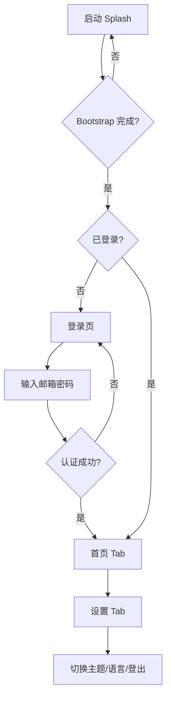

# 新手指引

欢迎 Fork **Flutter Starter Template**。本文档假设你已有基础 Flutter 经验，但**不熟悉本仓库**，目标是在 **30～60 分钟**内完成：环境准备 → 跑起来 → 理解主流程 → 完成第一个小改动。

> 架构细节见 [ARCHITECTURE.md](./ARCHITECTURE.md) · Fork 生产前见 [TEMPLATE_CHECKLIST.md](./TEMPLATE_CHECKLIST.md)

---

## 目录

1. [你需要准备什么](#1-你需要准备什么)
2. [五分钟跑起来](#2-五分钟跑起来)
3. [第一次打开项目：先看哪里](#3-第一次打开项目先看哪里)
4. [应用是怎么跑起来的](#4-应用是怎么跑起来的)
5. [走一遍用户主流程](#5-走一遍用户主流程)
6. [Mock 模式说明](#6-mock-模式说明)
7. [常用开发命令](#7-常用开发命令)
8. [你的第一个改动：改首页文案](#8-你的第一个改动改首页文案)
9. [你的第二个改动：加一条国际化文案](#9-你的第二个改动加一条国际化文案)
10. [如何新增一个页面](#10-如何新增一个页面)
11. [如何对接自己的后端](#11-如何对接自己的后端)
12. [如何写测试](#12-如何写测试)
13. [常见问题](#13-常见问题)
14. [推荐学习路径](#14-推荐学习路径)

---

## 1. 你需要准备什么

| 工具 | 版本建议 | 检查命令 |
|------|----------|----------|
| Flutter | Stable 通道 | `flutter --version` |
| Dart | ≥ 3.12（见 `pubspec.yaml`） | 随 Flutter 附带 |
| IDE | VS Code / Android Studio / Cursor | 安装 Dart + Flutter 插件 |
| 模拟器或真机 | iOS Simulator / Android Emulator | `flutter devices` |

可选：

- Xcode（跑 iOS / macOS）
- Android Studio（跑 Android）
- Chrome（跑 Web）

克隆仓库后进入目录：

```sh
git clone <你的仓库地址>
cd flutter_starter_template
flutter pub get
```

---

## 2. 五分钟跑起来

### 2.1 安装依赖

```sh
flutter pub get
flutter gen-l10n
```

`gen-l10n` 会根据 `lib/l10n/*.arb` 生成 `lib/l10n/generated/`，**改文案后都要执行一次**。

### 2.2 启动 Debug（默认 Mock，无需后端）

```sh
flutter run --dart-define=APP_ENV=debug
```

指定设备：

```sh
flutter run -d chrome --dart-define=APP_ENV=debug
flutter run -d <device_id> --dart-define=APP_ENV=debug
```

### 2.3 登录试试

Debug 下 `enableMock: true`，**不需要真实服务器**：

| 字段 | 填什么 |
|------|--------|
| 邮箱 | 任意合法格式，如 `demo@example.com` |
| 密码 | 至少 6 位，如 `password123` |

登录成功后会进入 **首页欢迎页**，底部可切到 **设置**。

### 2.4 确认项目健康

```sh
dart format lib test
flutter analyze
flutter test
```

全部通过即可开始开发。当前约有 50 项自动化测试。

---

## 3. 第一次打开项目：先看哪里

建议按这个顺序浏览代码（不必一次读完）：

| 顺序 | 文件 | 看什么 |
|------|------|--------|
| ① | `lib/main.dart` | 入口很短，只有 bootstrap |
| ② | `lib/bootstrap.dart` | 全局错误、ProviderScope |
| ③ | `lib/app/app.dart` | MaterialApp.router、主题、语言 |
| ④ | `lib/app/router/app_router.dart` | 路由表 + 登录守卫 |
| ⑤ | `lib/features/splash/presentation/controllers/splash_controller.dart` | 启动时在干什么 |
| ⑥ | `lib/features/auth/presentation/controllers/auth_controller.dart` | 登录状态机 |
| ⑦ | `lib/features/home/presentation/pages/home_page.dart` | 首页占位（你会先改这里） |
| ⑧ | `lib/app/environment/env_config.dart` | 环境、Mock、API 地址 |

目录大图见 [ARCHITECTURE.md §3](./ARCHITECTURE.md#3-目录结构总览)。

---

## 4. 应用是怎么跑起来的

```
main.dart
  └─ bootstrap()
       ├─ 初始化 Flutter Binding、LiquidGlass
       ├─ 注册全局错误处理
       └─ runApp(ProviderScope → StarterApp)
            └─ MaterialApp.router
                 ├─ theme / locale 来自 Riverpod
                 └─ routerConfig 来自 routerProvider
```

**Riverpod** 贯穿全项目：页面用 `ConsumerWidget` / `ConsumerStatefulWidget`，通过 `ref.watch` / `ref.read` 获取状态和调用方法。

**你不用手动 `Navigator.push`**：页面跳转由 `go_router` 管理，例如：

```dart
import 'package:go_router/go_router.dart';
import '../../../../app/router/app_routes.dart';

context.go(AppRoutes.settings);
```

---

## 5. 走一遍用户主流程



### 5.1 Splash（`/`）

- 至少展示 2 秒品牌图（`assets/images/splash.png`）
- 并行：恢复登录态、检查版本（Mock 下通常无更新弹窗）
- 完成后由路由自动跳转

### 5.2 登录 / 注册

- 路径：`/login`、`/register`
- 未登录时访问 `/home` 会被 **redirect** 回登录页（集成测试有覆盖）

### 5.3 首页 + 设置（Tab）

- `/home` 与 `/settings` 共用底部玻璃 Tab 栏
- 首页当前是 **模版占位**，提示你替换为产品首页
- 设置页可切换亮/暗色、中/英文、检查更新、登出

---

## 6. Mock 模式说明

这是新手最容易困惑的点。

| 问题 | 答案 |
|------|------|
| 为什么没配 API 也能登录？ | Debug 默认 `enableMock: true`，走 `MockAuthService` |
| Mock 开关在哪？ | `lib/app/environment/env_config.dart` → `enableMock` |
| 怎么连真后端？ | 设 `enableMock: false`，配置 `baseUrl`，见下文 §11 |
| Prod 包会用 Mock 吗？ | 不会，`APP_ENV=prod` 时 `enableMock: false` |

Mock 行为摘要：

- **登录 / 注册**：合法邮箱 + 密码 ≥ 6 位即成功
- **版本检查**：默认返回「已是最新」，不会挡启动
- **Branding**：不发起网络请求

---

## 7. 常用开发命令

```sh
# 依赖与代码生成
flutter pub get
flutter gen-l10n

# 格式化 / 静态分析 / 测试
dart format lib test
flutter analyze
flutter test

# 只跑集成测试
flutter test test/integration/

# 可选：Riverpod 代码生成（当前非必须）
dart run build_runner build --delete-conflicting-outputs
```

### 环境构建示例

```sh
# 本地 Debug
flutter run --dart-define=APP_ENV=debug

# 接近生产的构建（关闭 Mock）
flutter build apk --dart-define=APP_ENV=prod
flutter build ios --dart-define=APP_ENV=prod
flutter build web --dart-define=APP_ENV=prod
```

---

## 8. 你的第一个改动：改首页文案

目标：把欢迎语改成你自己的产品名（仍走国际化）。

### 8.1 改 ARB 文案

编辑 `lib/l10n/app_zh.arb`：

```json
"homeWelcomeTitle": "欢迎使用我的 App"
```

编辑 `lib/l10n/app_en.arb`（**必须同步**）：

```json
"homeWelcomeTitle": "Welcome to My App"
```

### 8.2 重新生成 l10n

```sh
flutter gen-l10n
```

### 8.3 确认页面已使用 l10n

打开 `lib/features/home/presentation/pages/home_page.dart`，应看到类似：

```dart
Text(l10n.homeWelcomeTitle, style: typography.pageTitle),
```

**不要**写成 `Text('欢迎使用我的 App')`——项目规范禁止硬编码用户可见文案。

### 8.4 热重载

保存后按 `r` 热重载，或 `R` 热重启。切换设置页语言可验证中英文。

---

## 9. 你的第二个改动：加一条国际化文案

目标：在首页增加一句「版本：x.y.z」。

### 步骤

1. 在 `app_en.arb` / `app_zh.arb` 增加键，例如：

```json
"homeVersionLine": "Version {version}",
"@homeVersionLine": {
  "placeholders": { "version": {} }
}
```

中文：

```json
"homeVersionLine": "版本 {version}"
```

2. `flutter gen-l10n`

3. 在 `HomePage` 中读取 `packageInfoProvider`（已有示例可参考 `settings_page.dart`），显示：

```dart
packageInfo.when(
  data: (info) => Text(
    l10n.homeVersionLine(info.version),
    style: typography.caption,
  ),
  loading: () => const SizedBox.shrink(),
  error: (_, __) => const SizedBox.shrink(),
)
```

4. 运行 `flutter test`，确认无回归。

---

## 10. 如何新增一个页面

以添加「关于页」`/about` 为例。

### 10.1 定义路由常量

`lib/app/router/app_routes.dart`：

```dart
static const about = '/about';
```

### 10.2 创建页面

`lib/features/settings/presentation/pages/about_page.dart`（路径可自定）：

```dart
class AboutPage extends StatelessWidget {
  const AboutPage({super.key});

  @override
  Widget build(BuildContext context) {
    final l10n = context.l10n;
    return AppGlassScaffold(
      appBar: AppGlassAppBar(title: l10n.aboutTitle), // 需在 ARB 加 aboutTitle
      body: PageContainer(child: Text(l10n.aboutBody)),
    );
  }
}
```

### 10.3 注册路由

在 `lib/app/router/app_router.dart` 的 `routes` 列表增加：

```dart
GoRoute(
  path: AppRoutes.about,
  builder: (context, state) => const AboutPage(),
),
```

若页面需要登录，现有 `redirect` 会自动拦截未登录用户。

### 10.4 添加入口

在 `SettingsPage` 增加一个 `AppGlassListTile`，`onTap: () => context.push(AppRoutes.about)`。

### 10.5 检查清单

- [ ] ARB 中英文已添加
- [ ] `flutter gen-l10n` 已执行
- [ ] 圆角使用 `AppRadius`，间距使用 `AppSpacing`
- [ ] 字号使用 `context.typography` 语义 Token

更完整的 Feature 分层见 [ARCHITECTURE.md §14](./ARCHITECTURE.md#14-如何扩展新功能)。

---

## 11. 如何对接自己的后端

### 11.1 最快验证路径（仍用 Mock）

保持 `enableMock: true`，先专注 UI 与状态，后端并行开发。

### 11.2 切换 Remote

1. 打开 `lib/app/environment/env_config.dart`
2. 设置 `baseUrl` 为你的 API 根路径
3. 在 Debug 下临时设 `enableMock: false`（或仅用 `APP_ENV=prod` 构建验证）

默认 `RemoteAuthService` 约定：

| 接口 | 方法 | Body |
|------|------|------|
| `/auth/login` | POST | `{ "email", "password" }` |
| `/auth/register` | POST | `{ "email", "password", "displayName"? }` |

响应支持：

- 扁平 JSON：`{ "accessToken", "user": { ... } }`
- 或信封：`{ "code": 0, "data": { ... } }`

### 11.3 后端字段不一致时

复制并改造：

- `lib/features/auth/data/services/example_backend_auth_service.dart`（手机号等示例）
- 在 `authServiceProvider` 中替换实现类

**页面层仍只调用 `AuthController`，不要直接改 Dio。**

### 11.4 Token 自动携带（进阶）

当前 `api_interceptor.dart` **只打日志**。上线前你需要：

1. 从 `SecureStorage` 读取 Token
2. 在拦截器写入 `Authorization` 头
3. 处理 401（刷新 Token 或强制登出）

详见 [TEMPLATE_CHECKLIST.md §3.3](./TEMPLATE_CHECKLIST.md#33-token-与拦截器建议)。

---

## 12. 如何写测试

### 12.1 测试分类

| 类型 | 目录 | 适合测什么 |
|------|------|------------|
| 单元 | `test/features/` | Controller、纯逻辑 |
| Widget | `test/widget/` | 表单校验、页面渲染 |
| 集成 | `test/integration/` | 多页面 + 路由跳转 |

### 12.2 覆盖 Controller 示例

参考 `test/features/auth/auth_controller_test.dart`：

```dart
ProviderContainer(
  overrides: [
    authRepositoryProvider.overrideWithValue(_FakeAuthRepository()),
  ],
);
```

Fake Repository 实现 `AuthRepository` 接口，不发起真实网络。

### 12.3 覆盖整 App 流程

参考 `test/integration/app_flow_test.dart`：

- override `splashMinimumDurationProvider` → `Duration.zero`
- override `authRepositoryProvider`
- `pumpWidget(ProviderScope(..., child: StarterApp()))`

### 12.4 提交前自检

```sh
dart format lib test
flutter analyze
flutter test
```

与 CI 保持一致（`.github/workflows/flutter_ci.yml`）。

---

## 13. 常见问题

### Q：启动一直停在 Splash？

可能原因：

- Bootstrap 抛错 → 看控制台日志
- 版本强更 Mock 开启 → 检查 `enableForceUpdateMock`
- 集成测试忘记 override 最短展示时间

### Q：`flutter gen-l10n` 报错？

- 检查 ARB JSON 语法
- 占位符 `@key` 元数据是否完整
- 中英文 key 是否对齐

### Q：玻璃效果在 Web / 桌面异常？

模版针对移动端优化；桌面/Web 可依赖 `enableLiquidGlassFallback`（Feature Flag）。真机 iOS 效果最佳。

### Q：分析器提示 `context.l10n` 找不到？

确认：

1. 已 `flutter gen-l10n`
2. 文件顶部有 `import '../../../../app/localization/l10n_extensions.dart';`（路径按层级调整）
3. Widget 在 `MaterialApp` 子树内

### Q：我改了 `env_config` 但没生效？

`EnvConfig.current()` 在启动时读取。完整重启 App（非热重载），或停止后重新 `flutter run`。

### Q：想换包名和应用图标？

不在本指南重复，请直接跟 [TEMPLATE_CHECKLIST.md §1](./TEMPLATE_CHECKLIST.md#1-项目标识必做)。

---

## 14. 推荐学习路径

按天拆分（可压缩）：

| 阶段 | 任务 | 文档 |
|------|------|------|
| Day 1 | 跑通项目、Mock 登录、改首页文案 | 本文 §2、§8 |
| Day 2 | 读懂路由守卫 + Auth 状态机 | [ARCHITECTURE.md §5–6](./ARCHITECTURE.md) |
| Day 3 | 新增一个简单页面 + l10n | 本文 §10 |
| Day 4 | 读设计 Token，做一个玻璃卡片列表 | `iphone_17_pro_ui_theme.md`、`ios_font.md` |
| Day 5 | 对接 RemoteAuth 或写 Fake 测试 | 本文 §11–12 |
| 上线前 | 完成 Fork 清单全部必做项 | [TEMPLATE_CHECKLIST.md](./TEMPLATE_CHECKLIST.md) |

---

## 附：核心文件速查卡

| 我想… | 去这个文件 |
|--------|------------|
| 改 API 地址 / Mock | `lib/app/environment/env_config.dart` |
| 改路由 | `lib/app/router/app_router.dart` |
| 改登录逻辑 | `lib/features/auth/presentation/controllers/auth_controller.dart` |
| 改登录 UI | `lib/features/auth/presentation/pages/login_page.dart` |
| 改首页 | `lib/features/home/presentation/pages/home_page.dart` |
| 改主题色 | `lib/app/theme/app_color_schemes.dart` |
| 改字号 | `lib/app/theme/app_typography_tokens.dart` |
| 改文案 | `lib/l10n/app_*.arb` → `flutter gen-l10n` |
| 加全局 SnackBar | `lib/core/messaging/app_messenger.dart` |
| 看主流程测试 | `test/integration/app_flow_test.dart` |

祝你上手顺利。遇到架构级问题，优先查 [ARCHITECTURE.md](./ARCHITECTURE.md)；准备发布前，务必完成 [TEMPLATE_CHECKLIST.md](./TEMPLATE_CHECKLIST.md)。
